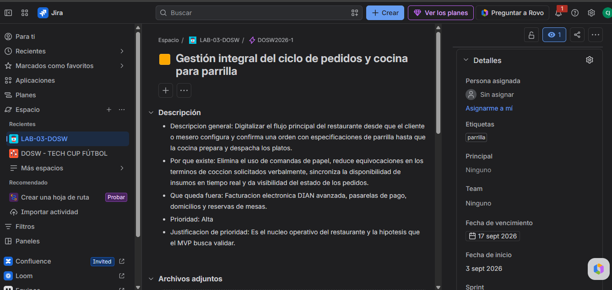

# Evidencias del Backlog en Jira

Proyecto: LA BRASA VIVA - Plataforma para restaurante tipo parrilla
Asignatura: DOSW
Entrega: Laboratorio 3 - Bloque B
Equipo: Carlos Sanchez, Cristian Moreno, Julian Morales
Fecha: 04/09/2026

---

# 1. Configuracion de la Epica

Descripcion de la actividad:
Creacion de la epica principal del proyecto con su titulo, descripcion completa, fecha limite y etiqueta de concepto parrilla.

Evidencia 1 - Detalle de la Epica:

---

# 2. Jerarquia del Backlog

Descripcion de la actividad:
Estructura y vinculacion de la epica con los modulos y capacidades del sistema (features de pedidos y cocina).

Evidencia 2 - Jerarquia del Backlog:

---

# 3. Historias de Usuario con Criterios de Aceptacion

Descripcion de la actividad:
Creacion de las 4 historias de usuario con su redaccion de negocio en formato Como / quiero / para, y sus criterios de aceptacion en formato Dado / Cuando / Entonces en la descripcion.

Evidencia 3.1 - Historia de Usuario 1 (Termino de coccion):

Evidencia 3.2 - Historia de Usuario 2 (Platos agotados):

Evidencia 3.3 - Historia de Usuario 3 (Comandas en cocina):

Evidencia 3.4 - Historia de Usuario 4 (Capacidad y estados):

---

# 4. Arbol de Vinculacion

Descripcion de la actividad:
Visualizacion de la vinculacion directa de cada historia de usuario con su epica padre y etiquetas de modulo correspondientes.

Evidencia 4 - Arbol de Vinculacion:

---

# 5. Subtareas Tecnicas

Descripcion de la actividad:
Detalle de las 12 subtareas tecnicas (3 por cada historia) con verbo en infinitivo, tipo de trabajo y responsable asignado.

Evidencia 5.1 - Subtareas de HU-01 y HU-02:

Evidencia 5.2 - Subtareas de HU-03 y HU-04:
   

---

# 6. Prioridades en el Backlog

Descripcion de la actividad:
Vista general del backlog en Jira mostrando las prioridades asignadas (Alta para HU-01 y HU-03, Media para HU-02 y HU-04).

Evidencia 6 - Backlog con Prioridades:
   

---

# 7. Cronograma o Timeline de Jira

Descripcion de la actividad:
Vista de la seccion Cronograma (Timeline) de Jira mostrando la epica completa desplegada a lo largo del tiempo.

Evidencia 7 - Timeline de Jira:
   

---

# 8. Sprint Backlog (Parte 8)

Descripcion de la actividad:
Configuracion del Sprint 1 en Jira incluyendo las historias seleccionadas para la primera iteracion con sus responsables asignados.

Evidencia 8 - Sprint Backlog en Jira:
   

Justificacion de la planeacion del Sprint 1:
Se seleccionaron las historias de prioridad Alta (HU-01 y HU-03) debido a que cubren de extremo a extremo el flujo basico de pedido en salon y recepcion en cocina, validando de forma inmediata la hipotesis central del MVP.
