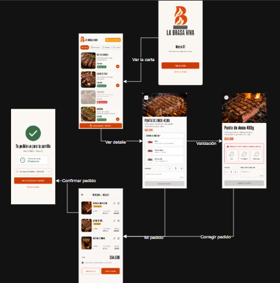
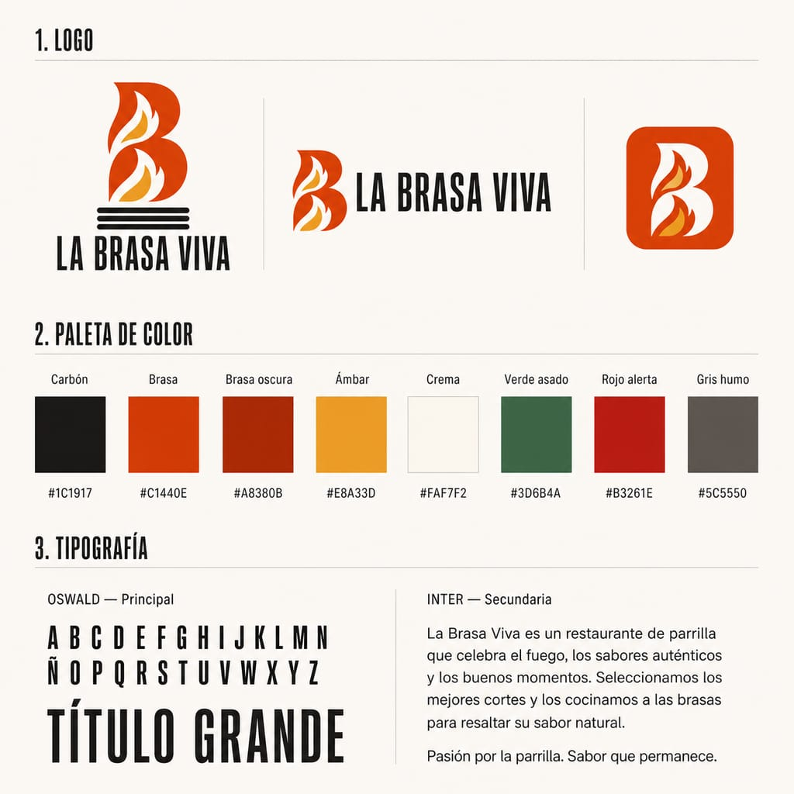
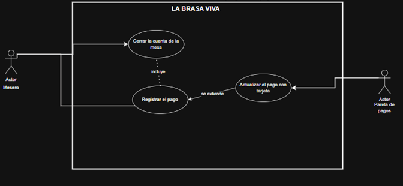

# ANÁLISIS DE REQUERIMIENTOS

| | |
|---|---|
| **Nombre del proyecto** | LA BRASA VIVA — Plataforma de gestión para restaurante tipo parrilla |
| **Asignatura** | Desarrollo y Operaciones de Software (DOSW) |
| **Entrega** | Laboratorio 3 — Partes 3 y 4 |
| **Equipo** | Carlos Sanches · Cristian Moreno · Julian Morales |
| **Concepto** | Parrilla |
| **Versión** | 1.1 |
| **Fecha** | 03/09/2026 |

Ver el alcance del sistema y el diagrama de contexto en [`scope.md`](./scope.md).

---

## PARTE 1 · IDENTIFICACIÓN DE REQUERIMIENTOS

### 1.1 Requerimientos funcionales

| Código | Nombre del requerimiento | Descripción breve | Actor principal | Servicio |
|---|---|---|---|---|
| **RF-01** | Autenticar usuario | Permitir iniciar sesión con correo y contraseña, y habilitar únicamente las funciones del rol asignado. | Todos | Identidad |
| **RF-02** | Consultar la carta | Permitir consultar los platos publicados con su precio y su estado de disponibilidad en tiempo real. | Cliente | Carta |
| **RF-03** | Agregar ítem al pedido | Permitir agregar un plato al pedido de una mesa registrando su cantidad y, si es un corte, su término de cocción. | Cliente / Mesero | Pedidos |
| **RF-04** | Modificar ítem del pedido | Permitir modificar la cantidad o quitar un ítem mientras el pedido esté en estado `RECIBIDO`. | Cliente / Mesero | Pedidos |
| **RF-05** | Confirmar el pedido | Permitir confirmar el pedido y enviarlo automáticamente al tablero de cocina. | Cliente / Mesero | Pedidos |
| **RF-06** | Cambiar el estado de un pedido | Permitir avanzar el estado de un pedido siguiendo la secuencia `RECIBIDO → EN_PREPARACION → LISTO → ENTREGADO`. | Cocina | Cocina |
| **RF-07** | Controlar la capacidad de la parrilla | Validar que no se superen los cortes simultáneos permitidos y encolar los que excedan la capacidad. | Cocina | Cocina |
| **RF-08** | Marcar ingrediente agotado | Permitir marcar un ingrediente como agotado y desactivar automáticamente los platos que lo utilizan. | Cocina / Administrador | Inventario |
| **RF-09** | Cerrar la cuenta y registrar el pago | Permitir cerrar la cuenta de una mesa, validar que sus pedidos estén entregados y registrar el medio de pago. | Mesero / Administrador | Pagos |
| **RF-10** | Emitir la factura electrónica | Permitir enviar los datos de la venta al proveedor de facturación electrónica para su emisión. | Sistema | Pagos |
| **RF-11** | Consultar el estado del pedido | Permitir al cliente consultar en qué etapa de preparación se encuentra su pedido. | Cliente | Pedidos |
| **RF-12** | Administrar la carta | Permitir crear, editar y desactivar platos sin borrar su historial de ventas. | Administrador | Carta |
| **RF-13** | Registrar usuario | Permitir registrar un usuario con sus datos personales, credenciales y rol dentro del restaurante. | Administrador | Identidad |
| **RF-14** | Generar reportes de venta | Permitir consultar las ventas del día agrupadas por plato, por franja horaria y por mesero. | Administrador | Reportes |

### 1.2 Requerimientos no funcionales

| Código | Categoría | Descripción del requerimiento | Fuente en el enunciado |
|---|---|---|---|
| **RNF-01** | Seguridad | El sistema debe restringir cada funcionalidad al rol autorizado (cliente, mesero, cocina, administrador). | Funcionalidades principales del sistema |
| **RNF-02** | Seguridad | El sistema no debe almacenar datos de tarjeta: la captura y validación se delegan a la pasarela de pagos. | Integración con sistemas externos |
| **RNF-03** | Rendimiento | El tablero de cocina debe reflejar un pedido nuevo en menos de 2 segundos. | Ejemplo de RNF del enunciado |
| **RNF-04** | Disponibilidad | El sistema debe operar durante todo el servicio sin reinicios, en jornadas de 12 horas continuas. | Ejemplo de RNF del enunciado |
| **RNF-05** | Usabilidad | Un cliente nuevo debe completar su primer pedido en máximo 4 pantallas. | Ejemplo de RNF del enunciado |
| **RNF-06** | Auditabilidad | Todo cambio de estado de un pedido debe quedar registrado con el usuario que lo hizo y la hora. | Ejemplo de RNF del enunciado |
| **RNF-07** | Accesibilidad | La interfaz debe mantener un contraste mínimo de 4.5:1 y ningún dato debe transmitirse únicamente por color. | Parte 4 — Brand guide y accesibilidad |
| **RNF-08** | Compatibilidad | La interfaz debe ser usable en pantallas de móvil, tablet y escritorio, ya que el salón y la cocina usan dispositivos distintos. | Definido por el equipo |
| **RNF-09** | Integridad | El precio de un plato debe quedar congelado al agregarse al pedido, aunque después cambie en la carta. | Reglas de negocio del cliente |

---

## PARTE 2 · REQUERIMIENTOS DETALLADOS

### FUNCIONALIDAD — RF-03

| | |
|---|---|
| **Código** | RF-03 |
| **Nombre** | Agregar ítem al pedido con término de cocción |

| | |
|---|---|
| **Descripción** | Permitir que el cliente o el mesero agregue un plato al pedido de una mesa con la cuenta abierta. Si el plato es un corte a la parrilla, el sistema exige registrar el término de cocción antes de aceptar el ítem. |
| **Cómo se ejecutará** | Desde la carta digital, el usuario selecciona un plato disponible, indica la cantidad y el término de cocción cuando aplica, y confirma la adición. El sistema valida la disponibilidad de los ingredientes, congela el precio y recalcula el total de la cuenta. |
| **Actor principal** | Cliente |
| **Actores secundarios** | Mesero |
| **Precondiciones** | El usuario está autenticado · la mesa tiene una cuenta abierta · el pedido está en estado `RECIBIDO` o aún no ha sido confirmado |

**DATOS DE ENTRADA**

| Nombre | Descripción | Tipo de campo | Reglas / Aplicación | Obligatorio |
|---|---|---|---|---|
| idMesa | Identificador de la mesa a la que pertenece la cuenta | Numérico | Debe corresponder a una mesa con cuenta abierta | Sí |
| idPlato | Identificador del plato seleccionado de la carta | Numérico | El plato debe estar publicado y disponible | Sí |
| cantidad | Número de unidades del plato | Numérico | Mayor a 0 | Sí |
| terminoCoccion | Grado de cocción del corte | Lista de selección | Azul, tres cuartos o bien asado. Obligatorio solo si el plato es un corte | Condicional |
| observaciones | Indicaciones adicionales para la cocina | Texto | Máximo 200 caracteres | No |

**DATOS DE SALIDA**

| Nombre | Descripción | Tipo de campo | Reglas / Aplicación | Obligatorio |
|---|---|---|---|---|
| idItem | Identificador del ítem creado dentro del pedido | Numérico | Generado por el sistema | Sí |
| precioUnitario | Precio del plato en el momento de agregarlo | Numérico | Queda congelado aunque la carta cambie | Sí |
| subtotalItem | Precio unitario multiplicado por la cantidad | Numérico | Calculado por el sistema | Sí |
| totalCuenta | Total acumulado de la cuenta de la mesa | Numérico | Recalculado en cada cambio | Sí |
| mensajeValidacion | Mensaje mostrado cuando el ítem no puede agregarse | Texto | Se muestra solo en los flujos alternos | No |

**FLUJO BÁSICO**

| Paso | Actor | Descripción | Excepciones | Pantalla |
|---|---|---|---|---|
| 1 | Cliente / Mesero | Consulta la carta y selecciona un plato disponible. | 1A | P1, P2 |
| 2 | Sistema | Valida que todos los ingredientes del plato estén disponibles. | 2A | P2 |
| 3 | Sistema | Solicita el término de cocción si el plato es un corte a la parrilla. | — | P3 |
| 4 | Cliente / Mesero | Selecciona el término de cocción e indica la cantidad. | 4A | P3 |
| 5 | Cliente / Mesero | Confirma la adición del ítem al pedido. | 5A | P3 |
| 6 | Sistema | Agrega el ítem, congela su precio actual y recalcula el total de la cuenta. | 6A | P5 |
| 7 | Sistema | Muestra el pedido actualizado con el detalle de los ítems y el total. | — | P5, P6 |

**FLUJO ALTERNO**

| Paso | Actor | Descripción | Excepciones | Pantalla |
|---|---|---|---|---|
| 1A | Sistema | El plato está desactivado en la carta: no se muestra como seleccionable. | — | P2 |
| 2A | Sistema | Un ingrediente está agotado: marca el plato como no disponible, lo muestra en gris e impide agregarlo (RN-02). | — | P2 |
| 4A | Sistema | El usuario no selecciona el término de cocción de un corte: no permite continuar y muestra el mensaje de campo obligatorio (RN-P01). | — | P4 |
| 5A | Sistema | El pedido ya pasó a `EN_PREPARACION`: rechaza el cambio e informa que la cocina ya lo tomó (RN-01). | — | P5 |
| 6A | Sistema | El precio del plato cambió en la carta: el ítem conserva el precio congelado en el momento de la adición (RN-04). | — | P5 |

**REGLAS DE NEGOCIO**

| No. | Descripción |
|---|---|
| RN-01 | Un pedido solo puede modificarse mientras esté en estado `RECIBIDO`. |
| RN-02 | Un plato no puede ordenarse si alguno de sus ingredientes está agotado. |
| RN-04 | El precio de un plato queda congelado al agregarse al pedido. |
| RN-P01 | Todo corte debe registrar su término de cocción; sin él no se envía a cocina. |

**ANEXOS**

*Diagrama de casos de uso*

*Prototipos — mockups del RF-03 (Parte 4)*

Este es el requerimiento seleccionado para el diseño de mockups. Se eligió por su claridad, por la cantidad de elementos visuales que requiere (formularios, tarjetas seleccionables, contadores y tablas) y porque su flujo básico tiene 7 pasos, muy por encima del mínimo de 3 exigido.

| Pantalla | Paso del flujo | Imagen |
|---|---|---|
| P1 — Bienvenida y apertura de mesa | 1 | [`mockup-p1-bienvenida.jpeg`](../images/mockup-p1-bienvenida.jpeg) |
| P2 — Carta con disponibilidad | 1, 2 y flujos 1A, 2A | [`mockup-p2-carta.jpeg`](../images/mockup-p2-carta.jpeg) |
| P3 — Detalle del plato y término de cocción | 3, 4, 5 | [`mockup-p3-detalle.jpeg`](../images/mockup-p3-detalle.jpeg) |
| P4 — Validación del término obligatorio | Flujo alterno 4A | [`mockup-p4-validacion.jpeg`](../images/mockup-p4-validacion.jpeg) |
| P5 — Mi pedido | 6, 7 | [`mockup-p5-pedido.jpeg`](../images/mockup-p5-pedido.jpeg) |
| P6 — Pedido confirmado | 7 | [`mockup-p6-confirmado.jpeg`](../images/mockup-p6-confirmado.jpeg) |

*Flujo de navegación entre pantallas*

*Guía de marca aplicada*

**Notas y comentarios:** el término de cocción se solicita en la misma pantalla de selección del plato (P3), no en una pantalla adicional, para no comprometer el requerimiento de máximo 4 pantallas (RNF-05). Todos los estados del mockup se comunican con color, ícono y texto simultáneamente, y la paleta cumple el contraste mínimo de 4.5:1 exigido por RNF-07.

---

### FUNCIONALIDAD — RF-06

| | |
|---|---|
| **Código** | RF-06 |
| **Nombre** | Cambiar el estado de un pedido en el tablero de cocina |

| | |
|---|---|
| **Descripción** | Permitir que el parrillero avance el estado de un pedido siguiendo la secuencia definida. El sistema valida la capacidad de la parrilla antes de aceptar el paso a preparación y registra quién hizo cada cambio y a qué hora. |
| **Cómo se ejecutará** | Desde el tablero de cocina, el parrillero ve los pedidos activos ordenados por hora de confirmación con el término de cocción de cada corte, y avanza el estado de cada uno con un solo toque. |
| **Actor principal** | Parrillero / Cocina |
| **Actores secundarios** | Cliente (recibe la notificación), Mesero |
| **Precondiciones** | El usuario está autenticado con rol de cocina · existe al menos un pedido confirmado en el tablero |

**DATOS DE ENTRADA**

| Nombre | Descripción | Tipo de campo | Reglas / Aplicación | Obligatorio |
|---|---|---|---|---|
| idPedido | Identificador del pedido a actualizar | Numérico | Debe existir y estar activo | Sí |
| nuevoEstado | Estado al que se quiere avanzar | Lista de selección | Debe ser el siguiente en la secuencia definida | Sí |
| idUsuario | Identificador del parrillero que realiza el cambio | Numérico | Tomado de la sesión activa | Sí |
| idIngrediente | Identificador del ingrediente que se marca como agotado | Numérico | Solo aplica al marcar agotados | No |

**DATOS DE SALIDA**

| Nombre | Descripción | Tipo de campo | Reglas / Aplicación | Obligatorio |
|---|---|---|---|---|
| estadoActual | Estado en el que quedó el pedido | Texto | Uno de los cuatro estados válidos | Sí |
| registroAuditoria | Usuario y hora del cambio de estado | Registro | Se genera en cada cambio (RNF-06) | Sí |
| tiempoEstimado | Minutos estimados de espera si el corte quedó en cola | Numérico | Solo cuando la parrilla está en capacidad máxima | No |
| cortesEnParrilla | Número de cortes en preparación simultánea | Numérico | Máximo 8 (RN-P02) | Sí |

**FLUJO BÁSICO**

| Paso | Actor | Descripción | Excepciones |
|---|---|---|---|
| 1 | Cocina | Abre el tablero y consulta los pedidos activos con su estado, mesa y término de cocción. | 1A |
| 2 | Cocina | Selecciona un pedido en `RECIBIDO` y solicita pasarlo a `EN_PREPARACION`. | 2A |
| 3 | Sistema | Valida que la parrilla no supere los 8 cortes simultáneos. | 3A |
| 4 | Sistema | Cambia el estado y registra el usuario y la hora del cambio. | — |
| 5 | Cocina | Al terminar la preparación, marca el pedido como `LISTO`. | — |
| 6 | Sistema | Notifica al cliente que su pedido está listo. | 6A |
| 7 | Mesero / Cocina | Marca el pedido como `ENTREGADO` al llevarlo a la mesa. | — |

**FLUJO ALTERNO**

| Paso | Actor | Descripción | Excepciones |
|---|---|---|---|
| 1A | Cocina | Marca un ingrediente como agotado: el sistema desactiva automáticamente los platos que lo usan (RN-02). | — |
| 2A | Sistema | El parrillero intenta saltarse un estado: rechaza el cambio e indica cuál es el siguiente estado válido. | — |
| 3A | Sistema | La parrilla está en capacidad máxima: deja el corte en cola, muestra el tiempo estimado y no cambia el estado (RN-P02). | — |
| 6A | Sistema | El servicio de notificaciones no responde: el pedido queda igual en `LISTO` y el aviso se reintenta sin bloquear el tablero. | — |

**REGLAS DE NEGOCIO**

| No. | Descripción |
|---|---|
| RN-01 | Al pasar a `EN_PREPARACION` el pedido deja de admitir cambios. |
| RN-02 | Un ingrediente agotado desactiva automáticamente los platos que lo usan. |
| RN-P02 | La parrilla admite máximo 8 cortes simultáneos; el resto queda en cola. |
| RN-P03 | Un corte de más de 25 minutos no puede ordenarse en los últimos 30 minutos de servicio. |

**ANEXOS**

- Prototipos: no aplica en esta entrega. El requerimiento seleccionado para el diseño de mockups fue el RF-03.

**Notas y comentarios:** el tablero debe reflejar un pedido nuevo en menos de 2 segundos (RNF-03), por lo que la vista se actualiza sin que el parrillero tenga que recargarla manualmente.

---

### FUNCIONALIDAD — RF-09

| | |
|---|---|
| **Código** | RF-09 |
| **Nombre** | Cerrar la cuenta de la mesa y registrar el pago |

| | |
|---|---|
| **Descripción** | Permitir que el mesero o el administrador cierre la cuenta de una mesa. El sistema valida que todos los pedidos estén entregados, registra el pago, solicita la factura electrónica y libera la mesa. |
| **Cómo se ejecutará** | Desde el mapa de mesas, el usuario selecciona la mesa, revisa el detalle de la cuenta, elige el medio de pago y confirma el cierre. Si el pago es con tarjeta, el sistema solicita la autorización a la pasarela. |
| **Actor principal** | Mesero |
| **Actores secundarios** | Administrador, Pasarela de pagos |
| **Precondiciones** | El usuario está autenticado · la mesa tiene una cuenta abierta · todos los pedidos de esa cuenta están en estado `ENTREGADO` |

**DATOS DE ENTRADA**

| Nombre | Descripción | Tipo de campo | Reglas / Aplicación | Obligatorio |
|---|---|---|---|---|
| idMesa | Identificador de la mesa cuya cuenta se va a cerrar | Numérico | Debe tener una cuenta abierta | Sí |
| medioPago | Forma de pago seleccionada | Lista de selección | Efectivo o tarjeta | Sí |
| montoRecibido | Valor entregado por el cliente | Numérico | Mayor o igual al total de la cuenta | Sí |
| datosFacturacion | Nombre e identificación para la factura electrónica | Texto | Requerido solo si el cliente solicita factura a su nombre | No |

**DATOS DE SALIDA**

| Nombre | Descripción | Tipo de campo | Reglas / Aplicación | Obligatorio |
|---|---|---|---|---|
| totalCuenta | Valor total de la cuenta cerrada | Numérico | Suma de los ítems con precio congelado | Sí |
| comprobantePago | Identificador de la transacción autorizada | Texto | Devuelto por la pasarela cuando el pago es con tarjeta | Condicional |
| numeroFactura | Número de la factura electrónica emitida | Texto | Devuelto por el proveedor de facturación | Sí |
| estadoMesa | Estado en el que queda la mesa tras el cierre | Texto | Debe quedar como disponible | Sí |

**FLUJO BÁSICO**

| Paso | Actor | Descripción | Excepciones |
|---|---|---|---|
| 1 | Mesero / Administrador | Selecciona la mesa y solicita el cierre de la cuenta. | 1A |
| 2 | Sistema | Valida que todos los pedidos de la cuenta estén en `ENTREGADO`. | 2A |
| 3 | Sistema | Muestra el detalle de la cuenta con el total a pagar. | — |
| 4 | Mesero / Administrador | Selecciona el medio de pago y registra el monto recibido. | — |
| 5 | Sistema | Solicita la autorización a la pasarela de pagos si el pago es con tarjeta. | 5A |
| 6 | Sistema | Registra el pago y marca la cuenta como cerrada. | — |
| 7 | Sistema | Envía los datos de la venta al proveedor de facturación electrónica. | 7A |
| 8 | Sistema | Libera la mesa y la deja disponible para una nueva cuenta. | — |

**FLUJO ALTERNO**

| Paso | Actor | Descripción | Excepciones |
|---|---|---|---|
| 1A | Sistema | Se intenta abrir una segunda cuenta en la misma mesa: lo impide hasta que la actual se cierre (RN-03). | — |
| 2A | Sistema | Hay pedidos sin entregar: no permite cerrar la cuenta e indica cuáles faltan. | — |
| 5A | Sistema | La pasarela rechaza el pago: mantiene la cuenta abierta y permite reintentar o cambiar el medio de pago. | — |
| 7A | Sistema | El servicio de facturación no responde: el pago queda registrado, la factura se encola para reenvío y la mesa se libera igual. | — |

**REGLAS DE NEGOCIO**

| No. | Descripción |
|---|---|
| RN-03 | Una mesa solo puede tener una cuenta abierta a la vez; se cierra únicamente cuando el pago queda registrado. |
| RN-04 | El total se calcula con los precios congelados en el momento en que cada ítem se agregó. |
| RNF-02 | El sistema no almacena datos de tarjeta: los delega a la pasarela de pagos. |

**ANEXOS**

- Prototipos: no aplica en esta entrega. El requerimiento seleccionado para el diseño de mockups fue el RF-03.

**Notas y comentarios:** el diagrama de casos de uso muestra únicamente la interacción con la pasarela de pagos. La emisión de la factura electrónica se documenta en el paso 7 del flujo básico y en su flujo alterno 7A, y corresponde al requerimiento RF-10.

---

## PARTE 3 · ANÁLISIS CRÍTICO

**a) ¿Identifica algún requerimiento que deba detallarse más? ¿Cuál(es)? ¿Por qué?**

Sí, dos:

- **RF-14 (generar reportes de venta).** Está redactado como *"consultar las ventas del día"*, pero no especifica qué métricas incluye, si aplica solo al día en curso o a un rango de fechas, ni en qué formato se exporta. Tal como está no es verificable: no se puede escribir una prueba que confirme si se cumple, lo que incumple el criterio de requerimiento verificable.
- **RF-08 (marcar ingrediente agotado).** No aclara si el descuento del inventario es automático al confirmar cada pedido o manual por parte de la cocina. La diferencia cambia el diseño por completo: en el primer caso hay que modelar el consumo por porción de cada plato, en el segundo no.

**b) ¿Existen requerimientos que se contradigan entre sí? ¿Cuál(es)?**

Sí, dos tensiones reales:

- **RF-04 frente a RN-01.** El enunciado plantea modificar ítems *"con la cuenta abierta"*, pero la regla RN-01 solo lo permite mientras el pedido esté en `RECIBIDO`. Una cuenta puede seguir abierta con pedidos ya en preparación, así que las dos condiciones no son equivalentes. **Resolución:** prevalece la regla de negocio; RF-04 se redactó con la restricción a nivel de *pedido*, no de *cuenta*.
- **RNF-05 frente a RN-P01.** El requerimiento de usabilidad exige completar el primer pedido en máximo 4 pantallas, pero la regla del concepto obliga a registrar el término de cocción de cada corte, lo que añade un paso. **Resolución:** el término se solicita dentro de la misma pantalla de selección del plato, no en una pantalla adicional. El mockup P3 refleja esta decisión.

**c) Si tuviera que dar prioridad, ¿cuáles serían los 2 más importantes para una primera iteración? Justifique.**

**RF-03 (agregar ítem al pedido)** y **RF-06 (cambiar el estado de un pedido)**.

Juntos cubren de punta a punta el ciclo carta → pedido → cocina, que es exactamente la hipótesis que el MVP declara querer validar. Además atacan de forma directa tres de los problemas del cliente: que el pedido dependa del mesero, que no haya visibilidad entre salón y cocina, y que el término de cocción se comunique de forma verbal. Sin estos dos requerimientos no hay nada que cobrar ni nada de qué generar reportes: todo lo demás es soporte alrededor de ellos.

**d) ¿Existe algún requerimiento que NO debería realizarse en el MVP? ¿Por qué?**

**RF-14 (generar reportes de venta).** No bloquea ninguna operación diaria: sin él el restaurante sigue vendiendo, cocinando y cobrando igual. Y como el sistema ya persiste cada venta, los reportes se pueden construir después sin haber perdido información histórica. Implementarlo ahora consumiría tiempo del sprint en algo que no valida la hipótesis del MVP.

Un caso de frontera es **RF-11 (consultar el estado del pedido)**: aporta valor real contra la falta de visibilidad entre salón y cocina, pero depende de que RF-06 ya funcione. Lo ubicaríamos al final de la primera iteración, no en el arranque.

---

## ABREVIATURAS

| Abreviatura | Significado |
|---|---|
| **RF** | Requerimiento funcional |
| **RNF** | Requerimiento no funcional |
| **RN** | Regla de negocio |
| **MVP** | Producto mínimo viable |
| **DIAN** | Dirección de Impuestos y Aduanas Nacionales |
| **UML** | Lenguaje unificado de modelado |
| **C4** | Modelo de diagramas de arquitectura en cuatro niveles |
| **WCAG** | Pautas de accesibilidad para el contenido web |

---

## HISTORIAL DE REVISIÓN

| Elaborado por | Aprobado por | Fecha | Descripción y justificación de cambios |
|---|---|---|---|
| Carlos Sanches, Cristian Moreno, Julian Morales | | 03/09/2026 | Versión inicial: identificación de requerimientos funcionales y no funcionales, detalle de tres requerimientos con la plantilla de análisis y respuestas al análisis crítico. |
| Carlos Sanches, Cristian Moreno, Julian Morales | | 03/09/2026 | Versión 1.1: se agregan los mockups del RF-03, el flujo de navegación y la guía de marca de la Parte 4, y la trazabilidad entre cada paso del flujo y su pantalla. |