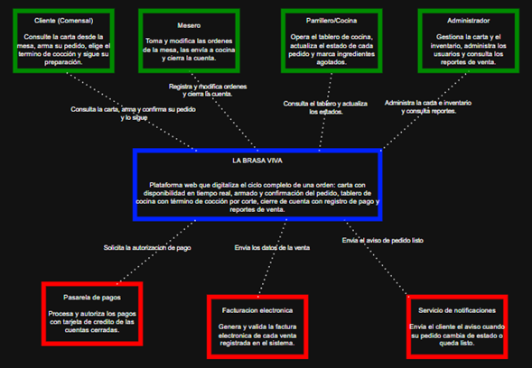

# Alcance del Proyecto — LA BRASA VIVA

**DOSW · Laboratorio 3 — Parte 2** · Equipo: Carlos Sanchez, Cristian Moreno, Julian Morales · Concepto: **parrilla** · v1.0

---

## 1. Sistema

**LA BRASA VIVA** es una plataforma web que digitaliza la operación de un restaurante de parrilla: consulta de la carta, armado y confirmación del pedido, preparación en cocina y cierre de la cuenta con su pago.

| Rol | Qué hace |
|---|---|
| **Cliente** | Consulta la carta, arma su pedido, elige el término de cocción y sigue su preparación. |
| **Mesero** | Toma y modifica órdenes, las envía a cocina y cierra la cuenta. |
| **Parrillero / Cocina** | Opera el tablero de cocina, actualiza estados y marca ingredientes agotados. |
| **Administrador** | Administra carta, inventario y usuarios, y consulta reportes de venta. |

El MVP busca **validar el ciclo completo de una orden** —carta, pedido, cocina y pago— antes de escalar a domicilios y reservas.

---

## 2. Problema a resolver

La operación se maneja hoy con comandas en papel, llamados verbales a la cocina y una caja registradora aislada. Esto genera:

- **P1** — La carta no se actualiza cuando se agota un plato: se venden cortes que la cocina no puede preparar.
- **P2** — El cliente no puede armar ni confirmar su pedido sin el mesero: esperas largas y menor rotación de mesas.
- **P3** — No hay visibilidad del estado del pedido entre salón y cocina.
- **P4** — No hay reportes por plato, franja horaria ni mesero: el dueño no tiene datos para decidir.
- **P5** — El término de cocción se comunica verbalmente o a mano: cortes devueltos y tiempo de parrilla perdido.

**Reglas de negocio del cliente**

- **RN-01** — Un pedido solo se modifica en estado `RECIBIDO`; al pasar a `EN_PREPARACION` no admite cambios.
- **RN-02** — Un plato no puede ordenarse si algún ingrediente está agotado.
- **RN-03** — Una mesa tiene una sola cuenta abierta a la vez; se cierra únicamente al registrar el pago.
- **RN-04** — El precio queda congelado al agregar el plato al pedido.

**Reglas propias del concepto parrilla**

- **RN-P01** — Todo corte debe registrar su término de cocción; sin él no se envía al tablero de cocina.
- **RN-P02** — La parrilla admite máximo 8 cortes simultáneos; los demás quedan en cola con tiempo estimado.
- **RN-P03** — Un corte de más de 25 minutos de preparación no puede ordenarse en los últimos 30 minutos de servicio.

---

## 3. Diagrama de contexto (C4 — Nivel 1)

- **Actores:** Cliente, Mesero, Parrillero/Cocina y Administrador.
- **Sistemas externos:** pasarela de pagos (autoriza el pago), facturación electrónica DIAN (emite la factura) y servicio de notificaciones (avisa al cliente).
- El actor **Domiciliario** no se incluye: los domicilios están fuera del alcance del MVP.

---

## 4. Alcance del sistema

**Dentro del alcance**

| # | Funcionalidad | Rol |
|---|---|---|
| A1 | Registro y autenticación con control de roles. | Todos |
| A2 | Consulta de la carta con disponibilidad en tiempo real. | Cliente |
| A3 | Armado del pedido: agregar, quitar y modificar ítems. | Cliente / Mesero |
| A4 | Registro del término de cocción por corte. | Cliente / Mesero |
| A5 | Confirmación del pedido y envío al tablero de cocina. | Cliente / Mesero |
| A6 | Tablero de cocina: `RECIBIDO → EN_PREPARACION → LISTO → ENTREGADO`. | Cocina |
| A7 | Administración de la carta: crear, editar y desactivar platos. | Administrador |
| A8 | Control de inventario e ingredientes agotados. | Admin / Cocina |
| A9 | Cierre de cuenta y registro del pago. | Admin / Mesero |
| A10 | Reportes de venta por plato, franja horaria y mesero. | Administrador |
| A11 | Control de capacidad de la parrilla y cola de cortes. | Cocina |

**Fuera del alcance:** domicilios y domiciliarios · reserva de mesas · fidelización y cupones · app móvil nativa · nómina y contabilidad · integración con plataformas de delivery · propinas y división de cuenta. El MVP valida primero el ciclo de la orden en salón; lo demás depende de que eso funcione.

**Supuestos y restricciones:** el restaurante tiene internet estable y dispositivos en salón y cocina; cada mesa tiene un identificador físico (QR o número); ya existe contrato con un proveedor de facturación autorizado por la DIAN; el sistema nunca almacena datos de tarjeta; debe operar 12 horas continuas sin reinicios y reflejar un pedido nuevo en el tablero en menos de 2 segundos.
